# GR.Agro
Plataforma em produção: [gragro.com.br](https://gragro.com.br)

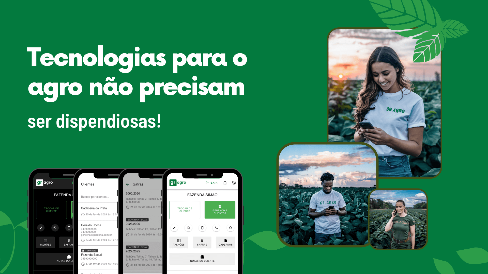

GR.Agro é uma plataforma híbrida (web, mobile web, mobile e desktop) voltado a agrônomos para o gerenciamento completo de clientes, talhões, safras e safrinhas, incluindo caderno de campo, registro fotográfico e compartilhamento de documentos. Atuei de forma independente no desenvolvimento Fullstack, sendo responsável por toda a arquitetura e implementação, do frontend ao backend.

Embora o projeto não tenha recebido investimento, sigo mantendo sua estrutura ativa e as tecnologias sempre atualizadas. Devido à complexidade e ao porte do sistema, ele permanece online como uma demonstração funcional e parte do meu portfólio profissional.

- [GR.Agro](#gragro)
  - [Stack e Arquitetura do Backend](#stack-e-arquitetura-do-backend)
    - [⚡ PHP com Laravel (Octane + Swoole)](#-php-com-laravel-octane--swoole)
    - [📬 Filas (Queues) e Jobs com Redis](#-filas-queues-e-jobs-com-redis)
    - [🧠 Query Caching e Data Caching](#-query-caching-e-data-caching)
    - [⏰ Agendamentos Automatizados (Schedules)](#-agendamentos-automatizados-schedules)
    - [🗄️ Banco de Dados MySQL](#️-banco-de-dados-mysql)
    - [🔐 Autenticação com Laravel Passport (JWT)](#-autenticação-com-laravel-passport-jwt)
    - [🧩 Middlewares Personalizados](#-middlewares-personalizados)
    - [🤖 Integração com Python (Automação com IA)](#-integração-com-python-automação-com-ia)
      - [Estrutura de pastas e arquivos da automação com IA](#estrutura-de-pastas-e-arquivos-da-automação-com-ia)
    - [🚀 Destaques Adicionais](#-destaques-adicionais)
      - [Tratamento de Exceções e Logs](#tratamento-de-exceções-e-logs)
      - [Deploy sem interrupções](#deploy-sem-interrupções)
        - [Laravel Forge](#laravel-forge)
        - [Github Actions](#github-actions)
  - [Stack e Arquitetura do Frontend](#stack-e-arquitetura-do-frontend)
    - [⚙️ Vue.js](#️-vuejs)
    - [🎨 Vuetify](#-vuetify)
    - [🌐 Nuxt.js](#-nuxtjs)
    - [📱 Capacitor.js](#-capacitorjs)
    - [Evidências de requisições em produção](#evidências-de-requisições-em-produção)
  - [Stack e Estratégia de Testes](#stack-e-estratégia-de-testes)
    - [Postman](#postman)
    - [Pest (PHP)](#pest-php)
    - [Cypress e Playwright (Javascript)](#cypress-e-playwright-javascript)
    - [Telas](#telas)
      - [Talhões e Safras](#talhões-e-safras)
      - [Caderno de Campo](#caderno-de-campo)
  - [Autor - Gercil Junio](#autor---gercil-junio)


## Stack e Arquitetura do Backend
O backend do GR.Agro foi desenvolvido inteiramente com Laravel (PHP), priorizando alta performance, escalabilidade e integração entre serviços. A seguir, estão as principais tecnologias e decisões arquiteturais adotadas no projeto.

### ⚡ PHP com Laravel (Octane + Swoole)
A API é executada com **Laravel Octane**, utilizando **Swoole** como motor de execução.   

O **Swoole** é uma extensão de alta performance para PHP baseada em corrotinas e I/O assíncrono, que mantém a aplicação carregada em memória entre as requisições.   

Isso reduz drasticamente o tempo de resposta e o consumo de recursos, além de permitir execução simultânea de tarefas e conexões persistentes com o banco de dados.   

O resultado é uma API extremamente rápida, com desempenho comparável a soluções em Node.js ou Go.

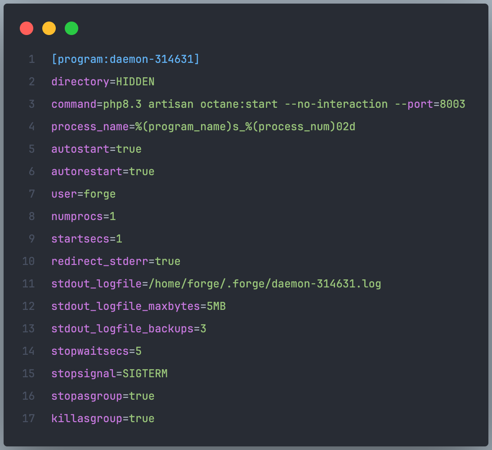

### 📬 Filas (Queues) e Jobs com Redis
O sistema utiliza Redis como driver de filas para o processamento assíncrono de tarefas, como:

- Envio de e-mails
- Processamento de cadastros
- Integração e sincronização entre serviços externos

Essa abordagem evita sobrecarga nas requisições principais, garantindo uma API mais leve e ágil, mesmo durante picos de uso.

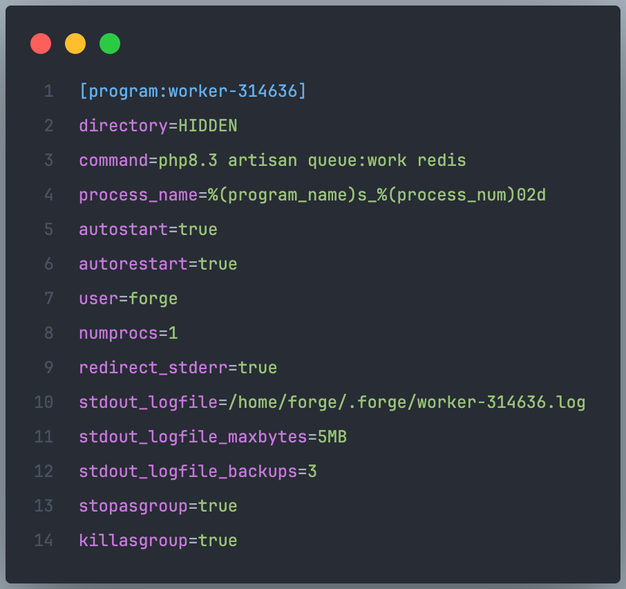

### 🧠 Query Caching e Data Caching
O Redis também é utilizado para armazenar consultas e dados em cache. O cache reduz o número de acessos ao banco de dados e melhora o tempo de resposta em endpoints muito acessados. Essa prática é essencial em projetos de API, pois melhora a escalabilidade, diminui o uso de recursos e mantém a experiência do usuário mais fluida.

### ⏰ Agendamentos Automatizados (Schedules)
O backend conta com rotinas agendadas automaticamente, responsáveis por:

- Buscar e processar dados externos
- Executar análises e relatórios
- Sincronizar informações entre sistemas

Esses agendamentos são configurados no Laravel Scheduler, com execução automatizada via cron, garantindo processos contínuos e autônomos.

### 🗄️ Banco de Dados MySQL
O banco de dados principal é o MySQL, com:

- Validações internas (chaves, integridade e relacionamentos)
- Validações externas (regras de negócio implementadas em Laravel)
- Uso do Eloquent ORM, que proporciona uma camada de acesso a dados expressiva e organizada

Essa estrutura garante consistência, segurança e manutenção simplificada do sistema.

### 🔐 Autenticação com Laravel Passport (JWT)
A autenticação é feita com Laravel Passport no modelo Passwordless (Sem Senha), utilizando Personal Tokens (JWT). Essa implementação garante autenticação segura, com controle de permissões e possibilidade de comunicação entre serviços.

### 🧩 Middlewares Personalizados
O projeto inclui diversos middlewares personalizados, responsáveis por:

- Autenticação e autorização de usuários
- Monitoramento e bloqueio de crawlers
- Controle de Rate Limit para limitar requisições abusivas
- Registro e análise de métricas de uso da API

Esses middlewares asseguram segurança, estabilidade e observabilidade em todo o ecossistema da aplicação.

### 🤖 Integração com Python (Automação com IA)
O projeto possui um módulo em Python responsável por integrações com ChatGPT (OpenAI API) e Azure AI Speech.

Esse módulo atua de forma autônoma realizandoem quatro etapas:

1. **Coleta** de notícias do setor agro em múltiplas fontes
2. **Geração** de resumos automáticos via ChatGPT
3. **Conversão** de texto em áudio com o Azure AI Speech
4. **Distribuição** automática de boletins diários em formato de áudio para os assinantes

Ao final, ele também gera vídeos no formato de story para o Instagram, utilizando a biblioteca MoviePy junto com o áudio gerado na etapa 3 e o título da notícia gerado na etapa 2, deixando-os prontos para postagem. A última etapa ainda não foi concluída, mas será desenvolvida posteriormente, permitindo que cada story seja postado automaticamente no Instagram, sem intervenção humana.

O resultado é um robô inteligente que garante informações rápidas, automatizadas e acessíveis. Todo o processo é executado duas vezes ao dia, utilizando agendamentos simples por meio do crontab.

#### Estrutura de pastas e arquivos da automação com IA
Somente para referência e conhecimento.

```
.
├── config
│   ├── database.py
│   ├── dates.py
│   ├── neural.py
│   └── storage.py
├── constants.py
├── controller
│   ├── audio.py
│   └── story.py
├── daily.py
├── requirements.txt
├── robot.py
├── sync.sh
└── utils
    ├── helpers.py
    └── replaces.py
```

### 🚀 Destaques Adicionais
- Validação de Requisições: uso de Form Requests e regras personalizadas de validação   
- Ambientes Isolados: configuração por ambiente (.env) com separação entre dev, staging e production

#### Tratamento de Exceções e Logs
Eerros centralizados com logs contextuais via [Sentry](https://sentry.io)   

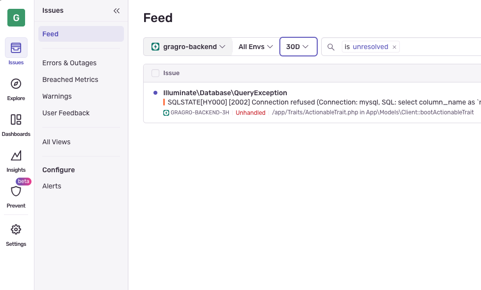
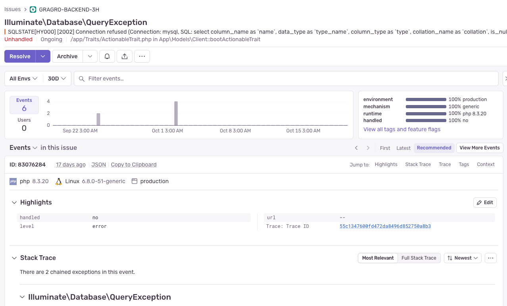

#### Deploy sem interrupções
Infraestrutura com atualizações contínuas e zero-downtime utilizando o serviço de gerenciamento e provisionamento [Laravel Forge](https://forge.laravel.com) e Github Actions

##### Laravel Forge
Painel de gerenciamento completo de todos os processos, com relatórios, monitoramentos e ações para casos críticos.

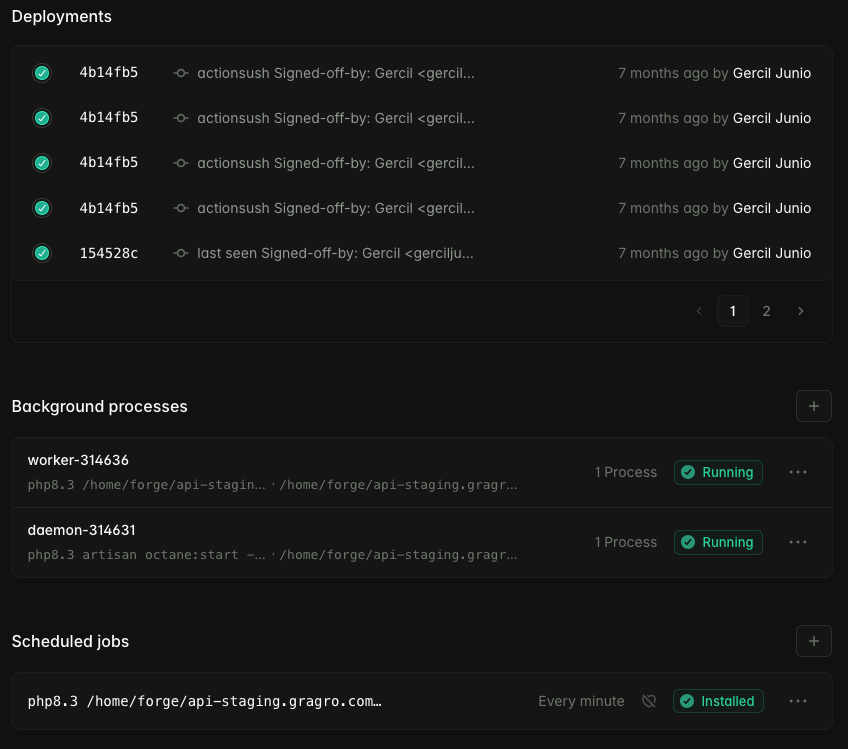

##### Github Actions
Deploy com zero-downtime completo do frontend.

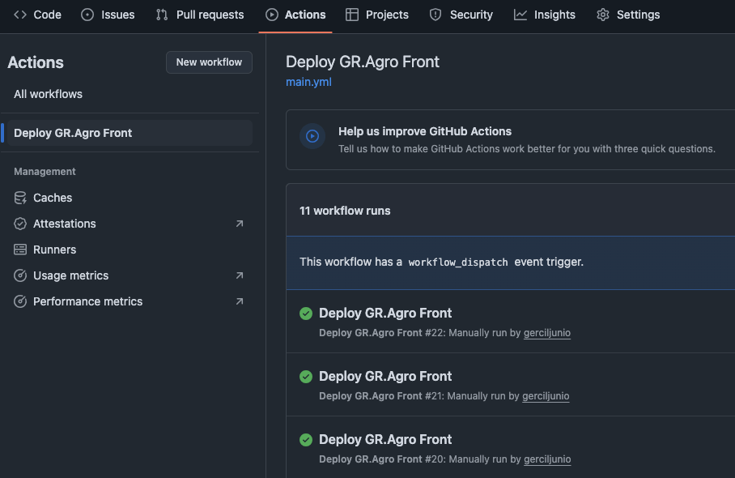

## Stack e Arquitetura do Frontend
O frontend do GR.Agro foi desenvolvido com foco em performance, escalabilidade e experiência do usuário, utilizando um ecossistema moderno baseado em Vue.js e tecnologias complementares que permitem uma aplicação única funcionar tanto na web quanto no mobile.

### ⚙️ Vue.js
O núcleo do frontend foi construído com Vue.js, sua arquitetura baseada em componentes facilitou o reuso de elementos em diferentes módulos da aplicação, garantindo padronização visual e consistência de comportamento.

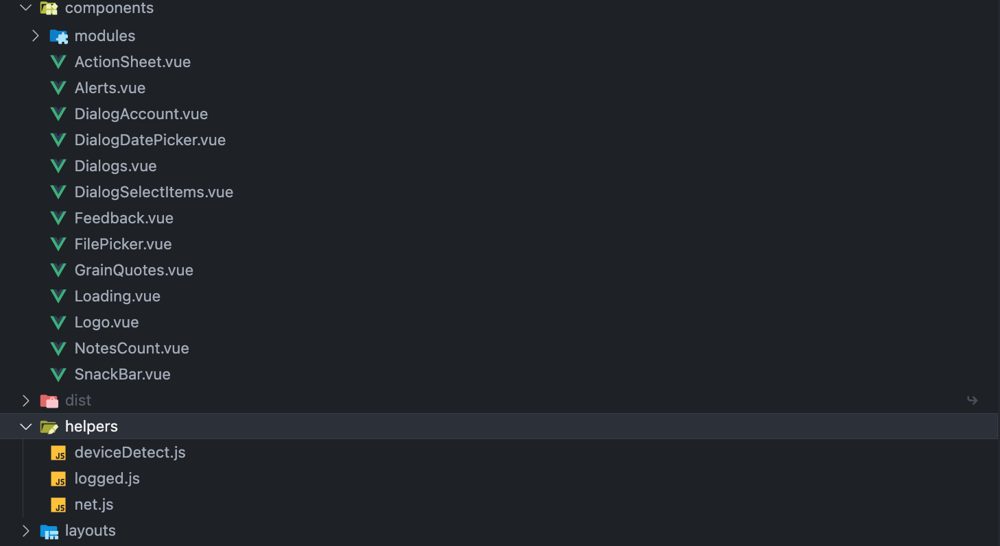

### 🎨 Vuetify
Para a camada visual, foi utilizado o Vuetify, um framework de componentes, ele oferece uma experiência de interface moderna, responsiva e intuitiva, permitindo o desenvolvimento rápido de telas sem comprometer a qualidade estética e a usabilidade.

O uso do Vuetify também garantiu acessibilidade nativa e responsividade total para diferentes dispositivos.


### 🌐 Nuxt.js

O projeto adota Nuxt.js para Server-Side Rendering (SSR) e Static Site Generation (SSG), melhorando o desempenho inicial da aplicação.

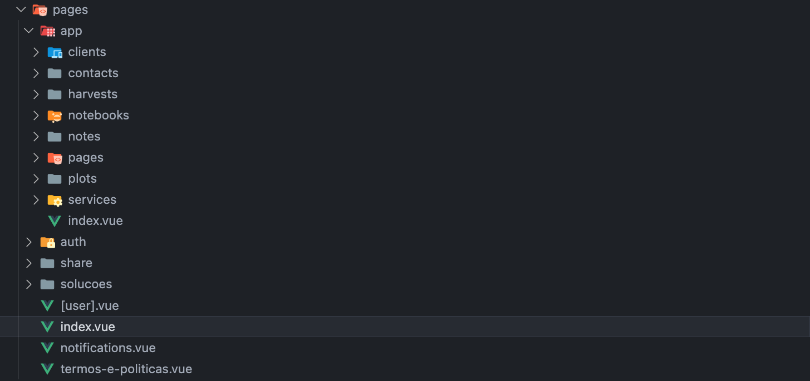

### 📱 Capacitor.js

O Capacitor.js foi utilizado para empacotar a aplicação web e convertê-la em aplicativo mobile híbrido, disponível para Android e iOS. Essa abordagem permitiu unificar o código-fonte, reduzindo custos e tempo de manutenção, além de garantir funcionalidades nativas, como notificações push e acesso a recursos do dispositivo.

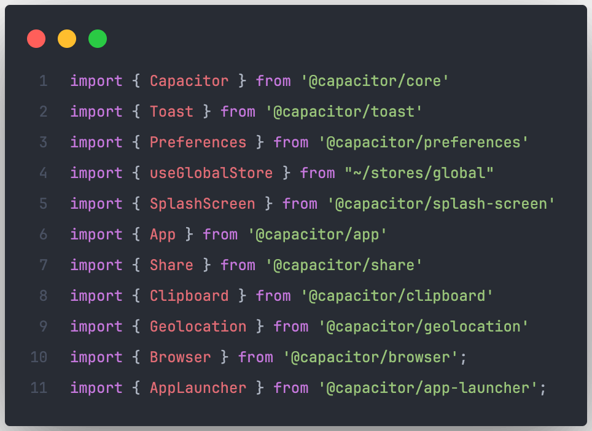

### Evidências de requisições em produção

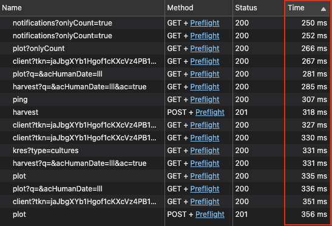

## Stack e Estratégia de Testes
O GR.Agro foi desenvolvido com foco em qualidade, estabilidade e previsibilidade, adotando uma stack de testes moderna e prática, que garante o bom funcionamento da API e das integrações externas.

### Postman
O Postman foi utilizado para testes manuais e validação de endpoints REST durante o desenvolvimento e integração entre serviços.

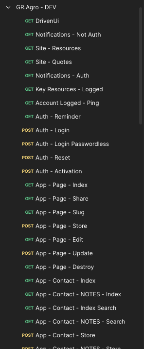

### Pest (PHP)
Os testes automatizados foram implementados com o Pest, framework moderno de testes para PHP, totalmente integrado ao Laravel.

#### 🚧 ToDo
> Em breve criarei repositórios públicos com exemplos de testes utilizando a API real em produção.

### Cypress e Playwright (Javascript)
Utilizado para testes automatizados de interface.

#### 🚧 ToDo
> Em breve serão criados repositórios públicos com exemplos de testes utilizando a API real do projeto em produção, desenvolvidos tanto com Playwright quanto com Cypress. O objetivo é demonstrar as habilidades técnicas do desenvolvedor em ambas as tecnologias.

### Telas

#### Talhões e Safras
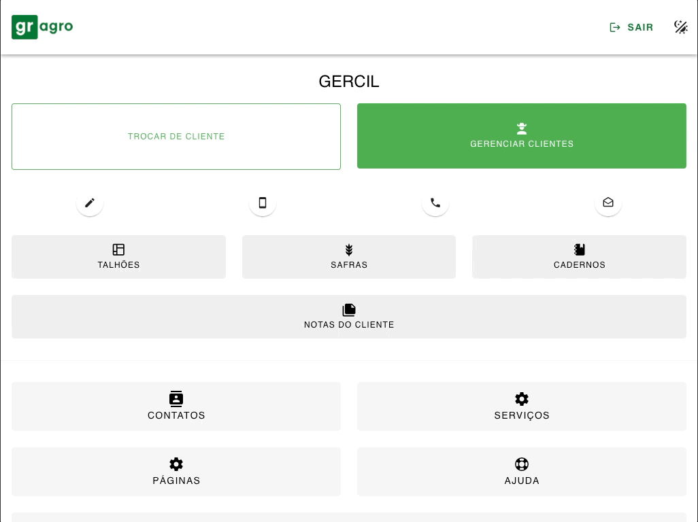

#### Caderno de Campo
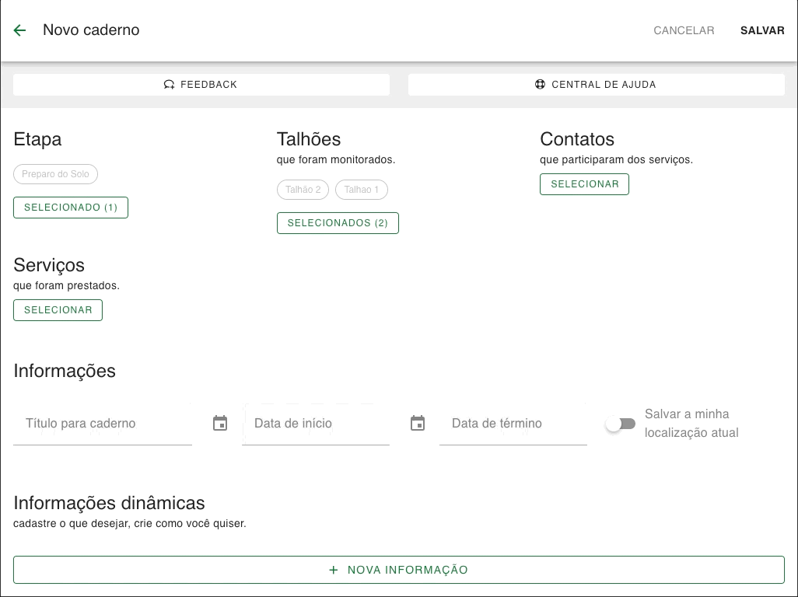

## Autor - Gercil Junio
- [📧 Gmail](mailto:gerciljunio@gmail.com)
- [💼 LinkedIn](https://www.linkedin.com/in/gercil)
- [🐙 GitHub](https://github.com/gerciljunio)